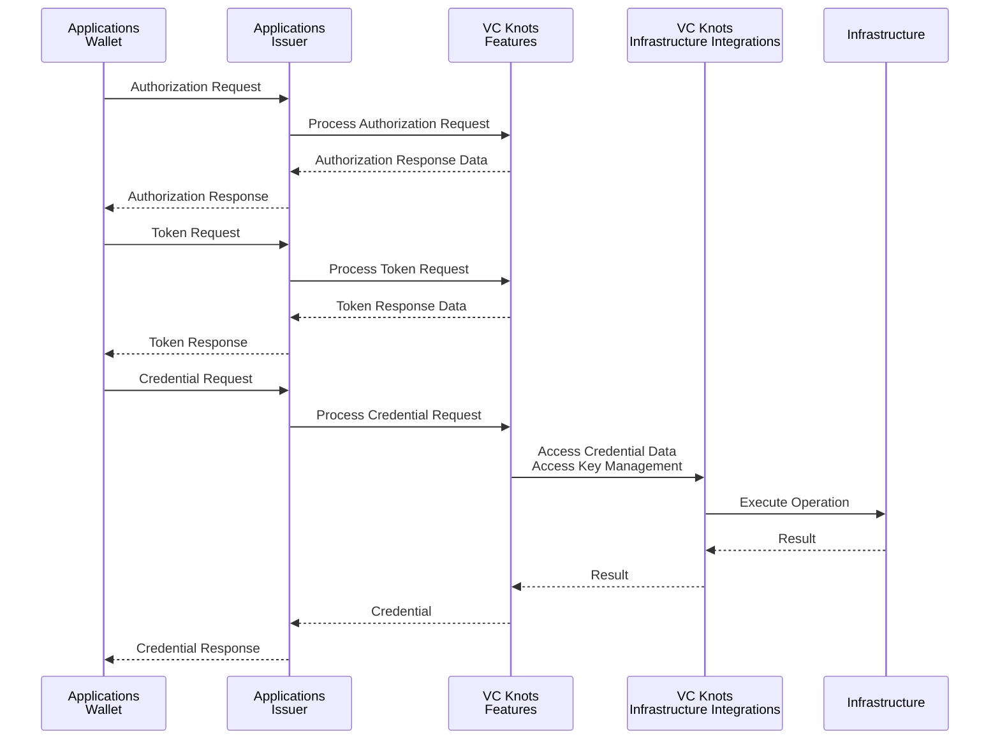
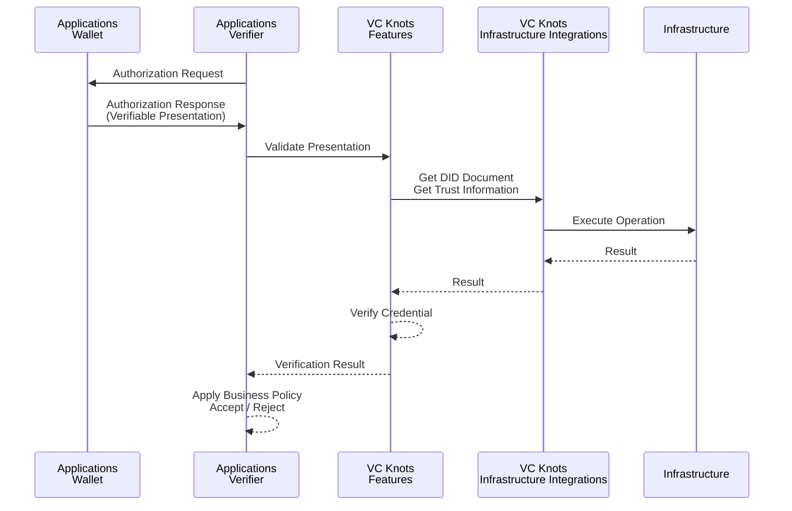

# Architecture Overview

VC Knots is a pluggable framework for building Verifiable Credentials (VC) ecosystems.

In VC ecosystems, interoperability based on standard protocols such as OpenID4VCI and OpenID4VP is important, while actual system configurations vary depending on the use case and environment.

For example, requirements for cloud environments, storage, key management methods, and Credential issuance rules differ between systems.

VC Knots provides the following extension points as `provider` to accommodate these differences.

- Enables replacement of system-specific business logic such as key generation, Nonce generation, identifier management, and Credential issuance policies.
- Abstracts connections to external infrastructure such as data stores and KMS, enabling support for environments such as AWS and Google Cloud.
- 
- For details, see [Plugin Development - Creating a Custom Provider](./plugin-development/03-custom-provider.md).

This design separates business logic from infrastructure dependencies.

By combining `provider`, developers can efficiently implement Issuer, Wallet, or Verifier.
Samples in the repository also demonstrate usage and recommended deployment configurations.

# Architecture Layers

VC Knots consists of the following layers.

| Layer | Description |
| --- | --- |
| **Applications** | Applications such as Issuer, Wallet, or Verifier built using VC Knots. |
| **Features** | Provides protocol implementations such as OpenID4VCI / OpenID4VP and Wallet functionality. |
| **Infrastructure Integrations** | Provides connections to external services such as databases and KMS. |
| **Infrastructure** | External infrastructure accessed through Infrastructure Integrations, such as databases, storage, and key management services. |

VC Knots provides the functionality of the Features and Infrastructure Integrations layers. These can be replaced or extended through `provider` according to the requirements of each system.

Applications are built on top of the Infrastructure configured for each system. Applications use Features to implement business logic. Infrastructure Integrations handle interactions between Features and Infrastructure.

The following diagram shows the scope covered by VC Knots.

# Package Structure

## Features

| Package | Language | Description |
| --- | --- | --- |
| `@trustknots/vcknots` | TypeScript | Implementation of OpenID4VCI / OpenID4VP, Issuer, Verifier, and Authorization Server functionality |
| `github.com/trustknots/vcknots/wallet` | Go | Wallet functionality, DID and key management, and Credential management |

## Infrastructure Integrations

| Package | Language | Description |
| --- | --- | --- |
| `@trustknots/aws` | TypeScript | Integration with AWS services such as DynamoDB, KMS, and Secrets Manager |
| `@trustknots/google-cloud` | TypeScript | Integration with Google Cloud services such as Cloud Firestore, Cloud KMS, and Secret Manager |

## Samples

| Package | Language | Description |
| --- | --- | --- |
| `@trustknots/server-core` | TypeScript | Provides common frameworks and components shared by sample servers |
| `@trustknots/server` | TypeScript | Sample server for a single-tenant configuration |
| `@trustknots/multi-server` | TypeScript | Sample server for a multi-tenant configuration |
| `@trustknots/server-aws` | TypeScript | Example configuration for deploying sample servers to AWS (Lambda + CDK) |
| `@trustknots/server-google-cloud` | TypeScript | Example configuration for deploying sample servers to Google Cloud |

# Verifiable Credentials Workflows and the Role of VC Knots

VC Knots provides standard protocol processing for OpenID4VCI / OpenID4VP as Features.

Applications use these capabilities to build Issuer, Wallet, orVerifier.

The following sections describe the role of each component in representative VC processing flows.

## Credential Issuance Flow (OpenID4VCI)

The Credential issuance process (OpenID4VCI) consists of the following steps.

1. The Wallet sends a Credential Request to the Issuer after completing the authorization and token acquisition flows defined by OpenID4VCI.
2. The Issuer delegates Credential issuance processing to VC Knots.
3. VC Knots uses Infrastructure Integrations to retrieve required data for Credential issuance and access key management services.
4. VC Knots generates and signs the Verifiable Credential based on the retrieved information.
5. The generated Verifiable Credential is returned to the Wallet.

## Presentation Verification Flow (OpenID4VP)

The Presentation verification process (OpenID4VP) consists of the following steps.

1. The Verifier sends an Authorization Request to the Wallet to request a Verifiable Presentation.
2. The Wallet returns an Authorization Response containing the Verifiable Presentation to the Verifier.
3. The Verifier delegates Presentation verification processing to VC Knots.
4. VC Knots accesses external services such as DID Resolvers and Trust Registries through Infrastructure Integrations.
5. VC Knots resolves DIDs and verifies Presentation signatures and Credential validity based on the retrieved information.
6. The verification result is returned to the Verifier, which decides whether to accept the Presentation based on the result.

