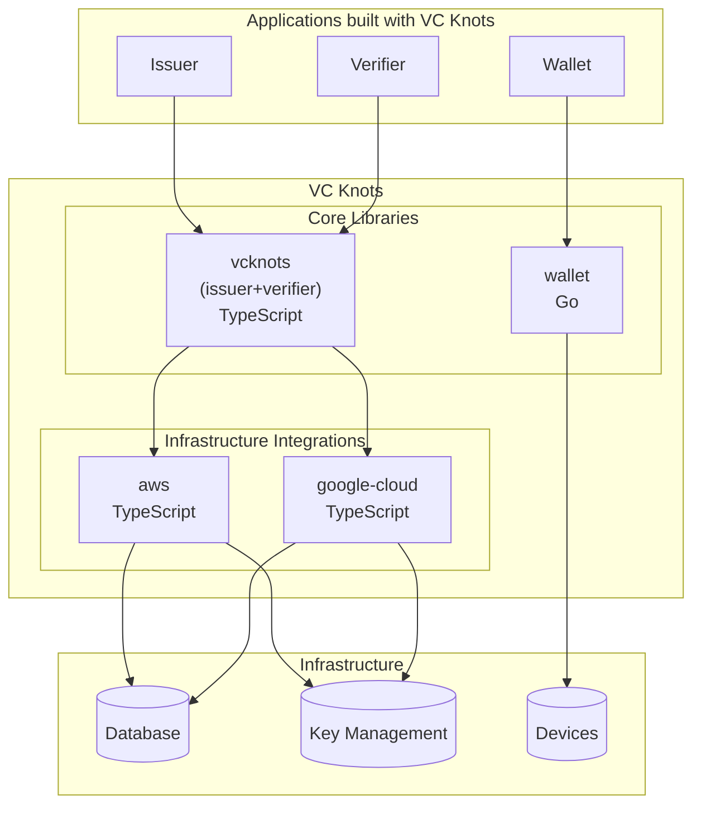
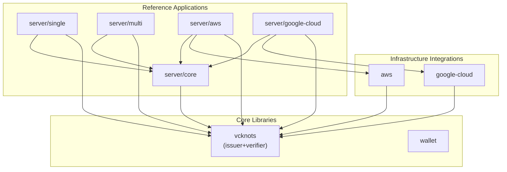
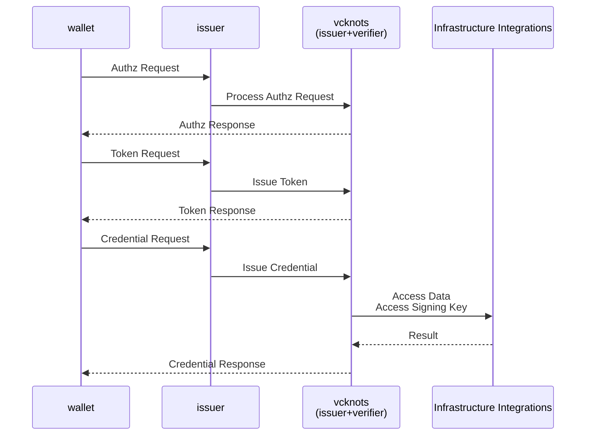
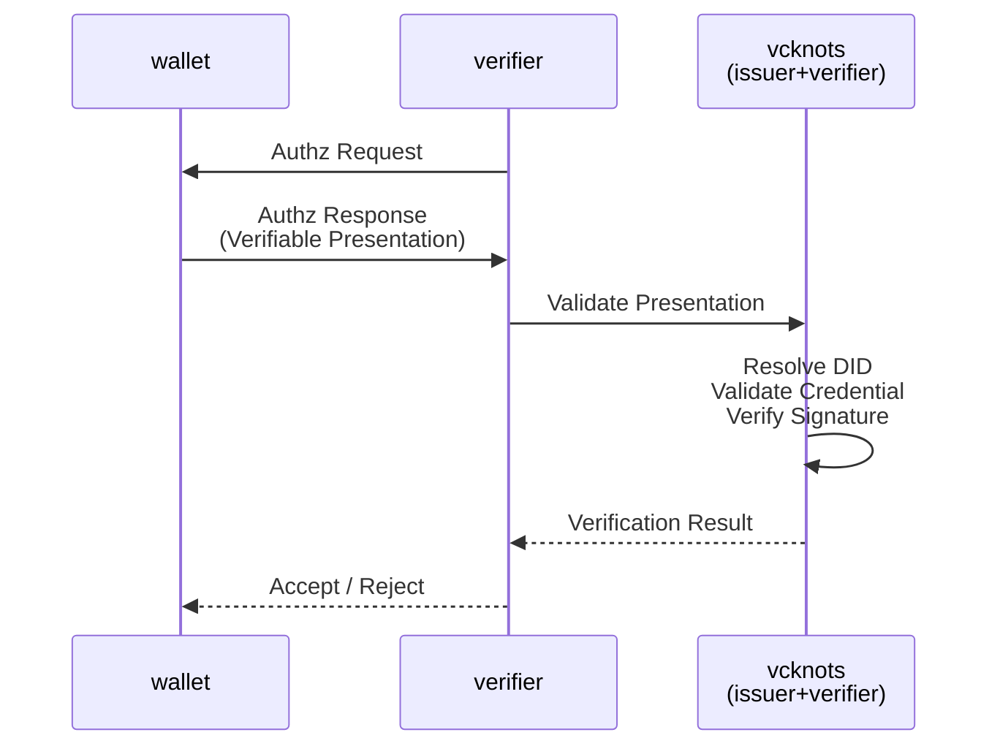

# Architecture Overview

VC Knots is a **pluggable framework for building Verifiable Credentials (VC) ecosystems**.

VC Knots is designed based on the following principles:

- **Separate protocol implementation from infrastructure implementation**, allowing OpenID4VCI and OpenID4VP to remain independent of cloud platforms.
- Support multiple execution environments, such as AWS and Google Cloud, by adding **Infrastructure Integrations**.
- Enable efficient implementation of Issuer, Wallet, and Verifier applications by composing reusable **Core Libraries**.
- Provide **Reference Applications** that demonstrate how to use the libraries and recommended deployment architectures.

---

# Overall Architecture

VC Knots consists of the following components:

| Component | Responsibility |
| --- | --- |
| **Applications built with VC Knots** | Applications such as Issuer, Wallet, and Verifier built using VC Knots. |
| **VC Knots Core Libraries** | Provide OpenID4VCI/OpenID4VP protocol implementations and wallet functionality. |
| **VC Knots Infrastructure Integrations** | Provide integrations with external services such as databases and KMS. |
| **Infrastructure** | External infrastructure accessed through Infrastructure Integrations, such as databases, storage services, and key management services. |

---

# Package Structure

## Core Libraries / Infrastructure Integrations

| Package | Language | Responsibility |
| --- | --- | --- |
| `vcknots` | TypeScript | Implements OpenID4VCI, OpenID4VP, Issuer, Verifier, and Authorization Server |
| `wallet` | Go | Provides wallet functionality, DID management, key management, and credential management |
| `aws` | TypeScript | Provides integrations with AWS services such as DynamoDB, KMS, and Secrets Manager |
| `google-cloud` | TypeScript | Provides integrations with Google Cloud services such as Cloud Firestore, Cloud KMS, and Secret Manager |

## Reference Applications

| Package | Language | Responsibility |
| --- | --- | --- |
| `server/core` | TypeScript | Provides the shared framework and common components used by the sample servers |
| `server/single` | TypeScript | Sample server for a single-tenant deployment |
| `server/multi` | TypeScript | Sample server for a multi-tenant deployment |
| `server/aws` | TypeScript | Deployment example for AWS using Lambda and CDK |
| `server/google-cloud` | TypeScript | Deployment example for Google Cloud |

---

# Package Relationships

---

# Credential Issuance Flow (OpenID4VCI)

Credential issuance using OpenID4VCI is performed as follows:

1. The Wallet completes the OpenID4VCI authorization and token exchange flow, then sends a Credential Request to the Issuer.
2. The Issuer delegates credential issuance to `vcknots`.
3. `vcknots` uses the Infrastructure Integrations to access the data and key management services required for credential issuance.
4. `vcknots` generates and signs the Verifiable Credential using the retrieved information.
5. The generated Verifiable Credential is returned to the Wallet.

---

# Presentation Verification Flow (OpenID4VP)

Presentation verification using OpenID4VP is performed as follows:

1. The Verifier sends an Authorization Request to the Wallet requesting a Verifiable Presentation.
2. The Wallet returns an Authorization Response containing the Verifiable Presentation.
3. The Verifier delegates presentation validation to `vcknots`.
4. `vcknots` resolves the DID using a DID Resolver or Trust Registry, then validates the credential and verifies the presentation signature.
5. The verification result is returned to the Verifier, which determines whether to accept or reject the presented credentials.