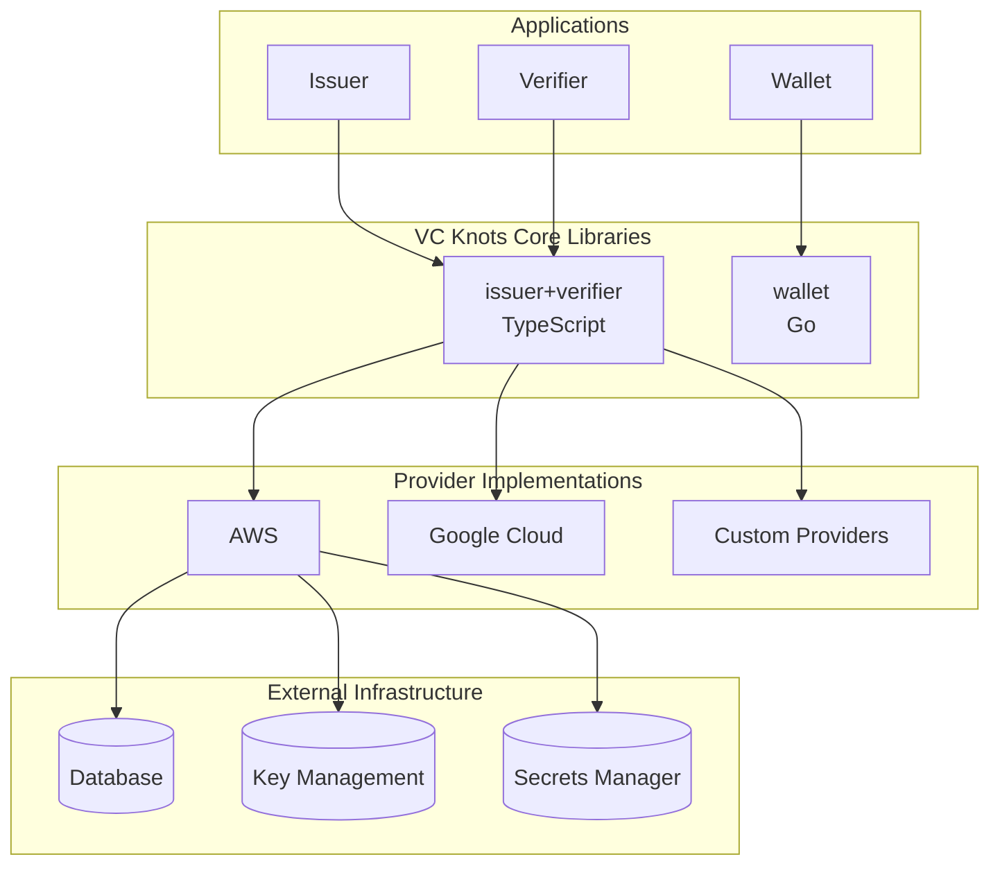
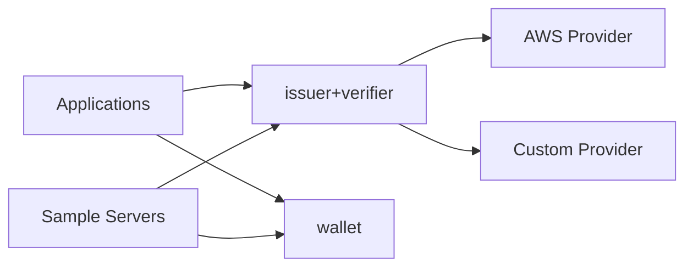
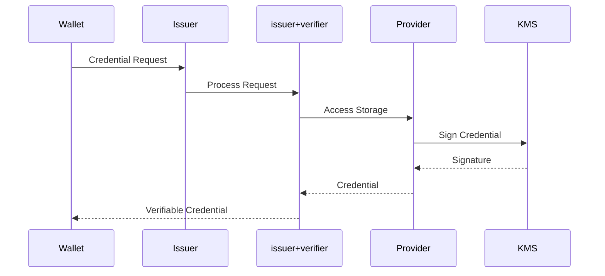
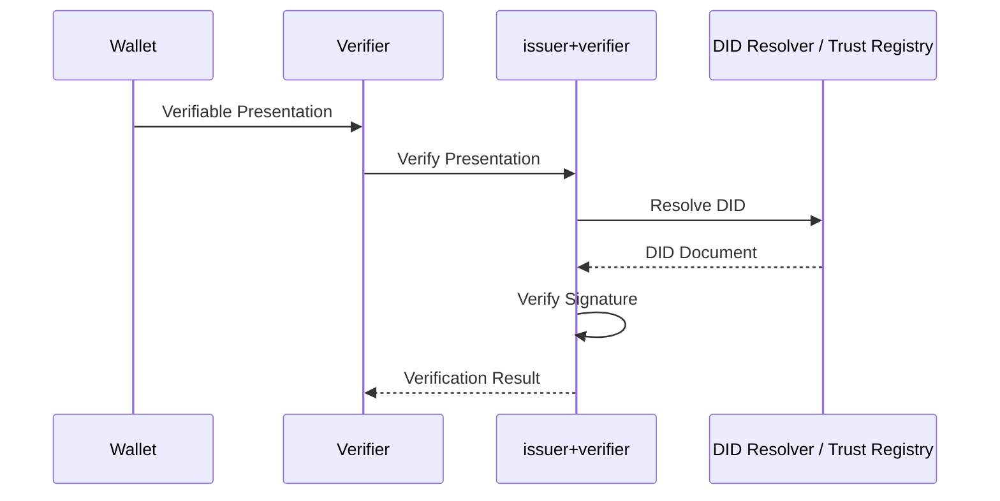
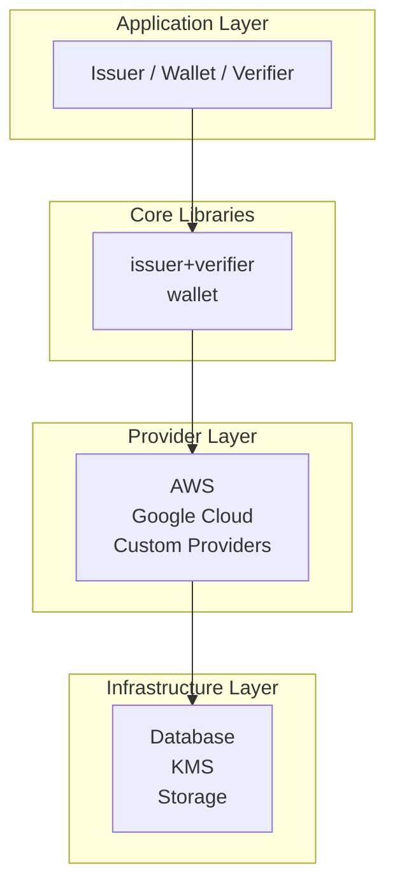

# Architecture Overview

VC Knots is a **pluggable framework** for building Verifiable Credentials (VC) ecosystems.

It provides reusable core libraries that implement OpenID4VCI and OpenID4VP, while allowing infrastructure components such as cloud providers, databases, and key management services to be integrated through pluggable providers. This enables developers to build Issuer, Wallet, and Verifier applications in a flexible and extensible way.

---

# Overall Architecture

The architecture is organized into four logical layers.

| Layer              | Responsibility                                                                          |
| ------------------ | --------------------------------------------------------------------------------------- |
| **Applications**   | Implement Issuer, Wallet, and Verifier applications.                                    |
| **Core Libraries** | Provide OpenID4VCI/OpenID4VP protocol implementations and wallet functionality.         |
| **Providers**      | Integrate external services such as databases, KMS, and cloud platforms.                |
| **Infrastructure** | Consists of the actual databases, key management services, and other backend resources. |

---

# Package Responsibilities

| Package               | Language   | Responsibility                                                                            |
| --------------------- | ---------- | ----------------------------------------------------------------------------------------- |
| `issuer+verifier`     | TypeScript | Implements OpenID4VCI/OpenID4VP, Issuer, Verifier, and Authorization Server functionality |
| `wallet`              | Go         | Provides wallet functionality, DID management, key management, and credential operations  |
| `aws`                 | TypeScript | AWS provider implementations for DynamoDB, KMS, Secrets Manager, and related services     |
| `server/single`       | TypeScript | Reference implementation for a single-tenant deployment                                   |
| `server/aws`          | TypeScript | AWS Lambda and CDK deployment example                                                     |
| `server/google-cloud` | TypeScript | Google Cloud deployment example                                                           |

---

# Package Relationships

The relationship between the packages is as follows:

* Applications are built using the `issuer+verifier` and `wallet` libraries.
* `issuer+verifier` communicates with external infrastructure through provider implementations.
* `server/*` packages are reference implementations that compose the reusable libraries.

---

# Credential Issuance Flow (OpenID4VCI)

### Flow

1. The Wallet sends an OpenID4VCI credential request.
2. The Issuer delegates protocol processing to `issuer+verifier`.
3. The provider accesses storage and key management services.
4. The credential is signed.
5. The Wallet receives and stores the issued Verifiable Credential.

---

# Presentation Verification Flow (OpenID4VP)

### Flow

1. The Wallet sends a Verifiable Presentation.
2. The Verifier delegates the verification process to `issuer+verifier`.
3. The library resolves the DID, verifies the signature, and validates trust requirements.
4. The verification result is returned to the Verifier.

---

# Layered Architecture

Applications are built on top of the core libraries, which interact with external infrastructure through provider implementations. This layered architecture separates protocol logic from infrastructure, making it easy to replace cloud platforms, storage backends, and key management services without affecting application logic.

---

# Design Principles

VC Knots is designed around the following principles:

* **Separation of protocol logic and infrastructure**, allowing business logic to remain independent of cloud-specific implementations.
* **Pluggable provider architecture**, enabling integration with AWS, Google Cloud, or custom environments.
* **Reusable core libraries**, allowing applications to implement OpenID4VCI/OpenID4VP without reimplementing protocol logic.
* **Reference server implementations**, demonstrating recommended deployment patterns while keeping the framework itself infrastructure-agnostic.
