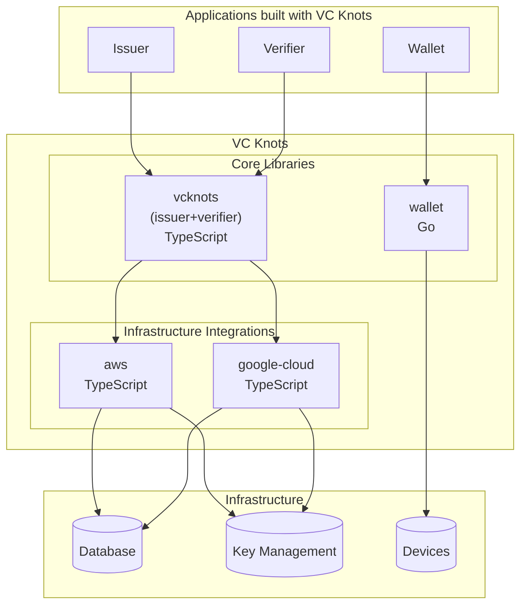
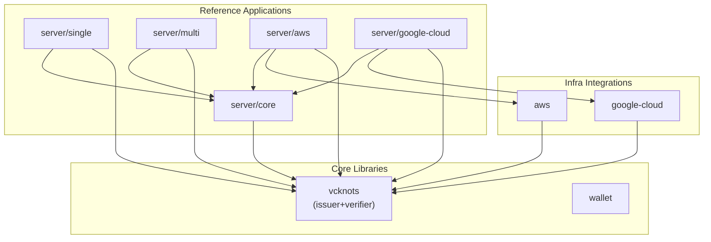
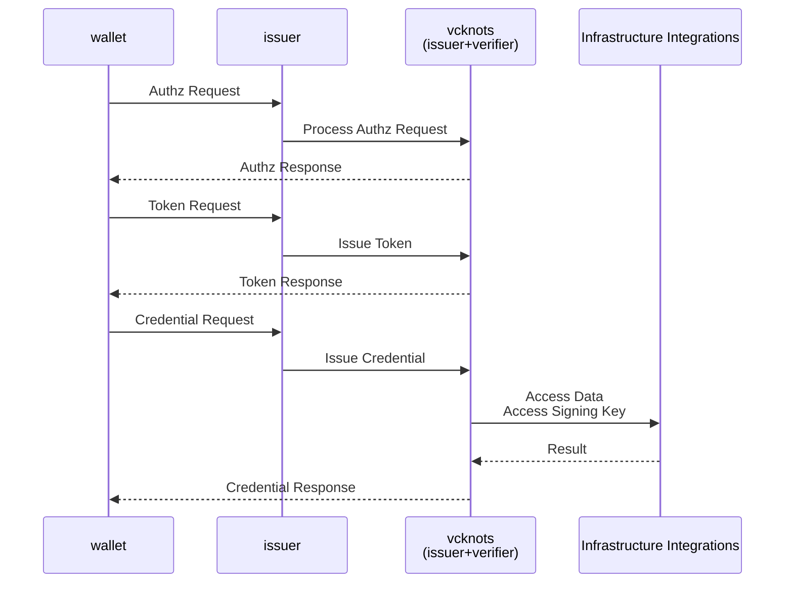
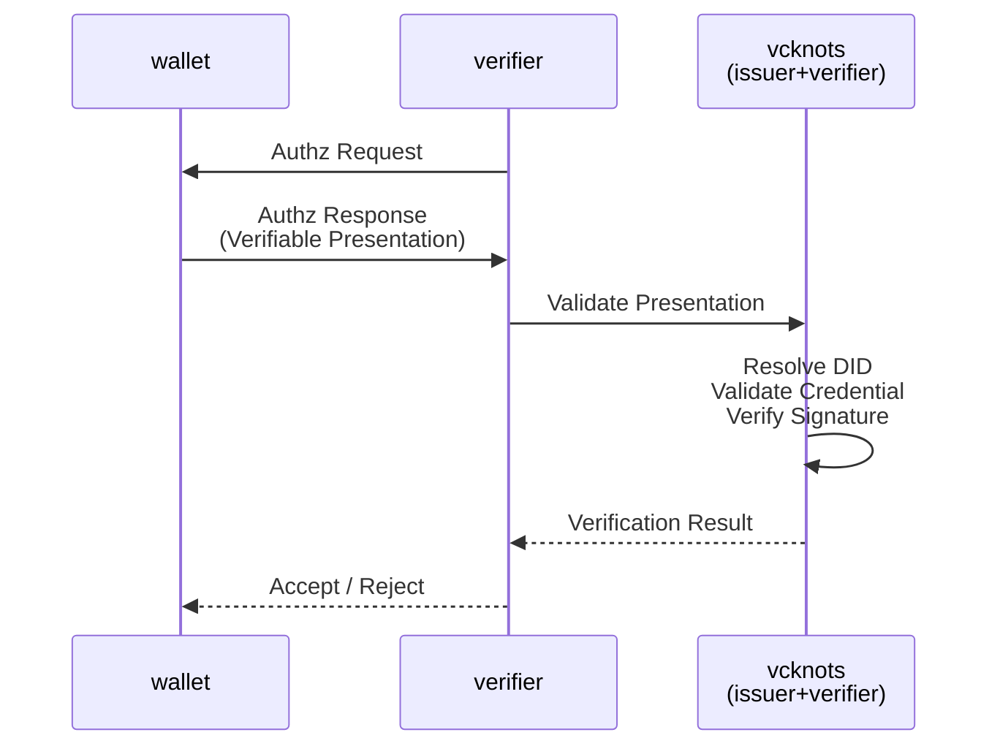

# アーキテクチャ概要

VC Knots は、**Verifiable Credentials（VC）エコシステム**を構築するためのプラガブルなフレームワークです。

VC Knots は、次の設計方針に基づいて構成されています。

- **プロトコル実装とインフラ実装を分離**し、OpenID4VCI / OpenID4VP の実装をクラウド環境から独立させます。
- Infrastructure Integrations を追加することで、AWS や Google Cloud など異なる実行環境へ容易に対応できます。
- Core Libraries を組み合わせることで、Issuer、Wallet、Verifier を効率的に実装できます。
- Reference Applications を提供することで、ライブラリの利用方法や推奨されるデプロイ構成を理解できます。

---

# 全体構成

VC Knots には次のコンポーネントが存在します。

| コンポーネント      | 役割     |
| --- | --- |
| **Applications built with VC Knots**   | VC Knots を利用して作成される Issuer・Wallet・Verifier のアプリケーションです。    |
| **VC Knots Core Libraries** | OpenID4VCI / OpenID4VP のプロトコルや Wallet 機能を提供します。 |
| **VC Knots Infrastructure Integrations**      | データベースや KMS などの外部サービスとの接続を提供します。  |
| **Infrastructure** | データベース、ストレージ、鍵管理サービスなど、Infrastructure Integrations が接続する外部インフラです。  |

---

# パッケージ構成

## Core Libraries / Infrastructure Integrations

| パッケージ    | 言語   | 役割   |
| --- | --- | --- |
| `vcknots`  | TypeScript | OpenID4VCI / OpenID4VP、Issuer、Verifier、Authorization Server の実装 |
| `wallet`        | Go  | Wallet 機能、DID・鍵管理、Credential の管理   |
| `aws`    | TypeScript | DynamoDB、KMS、Secrets Manager など AWS サービスとの連携を提供   |
| `google-cloud`    | TypeScript | Cloud Firestore、Cloud KMS、Secret Manager など GCP サービスとの連携を提供    |

## Reference Applications

| パッケージ  | 言語    | 役割  |
| --- | --- | --- |
| `server/core`  | TypeScript | サンプルサーバーで共通利用するフレームワークおよび共通コンポーネントを提供   |
| `server/single` | TypeScript | シングルテナント構成のサンプルサーバー   |
| `server/multi`  | TypeScript | マルチテナント構成のサンプルサーバー   |
| `server/aws`    | TypeScript | サンプルサーバーを AWS（Lambda + CDK）へデプロイするための構成例  |
| `server/google-cloud` | TypeScript | サンプルサーバーを Google Cloud へデプロイするための構成例  |
---

# パッケージ間の関係

---

# Credential 発行フロー（OpenID4VCI）

Credential 発行（OpenID4VCI）の処理は、次の流れで実行されます。

1. Wallet は OpenID4VCI の認可・トークン取得を経て、Issuer に Credential Request を送信します。
2. Issuer は `vcknots` に Credential 発行処理を委譲します。
3. `vcknots` は Infrastructure Integrations を利用して、Credential の発行に必要なデータの取得や鍵管理サービスへのアクセスを行います。
4. `vcknots` は取得した情報を基に Verifiable Credential を生成・署名します。
5. 生成された Verifiable Credential が Wallet に返却されます。

---

# Presentation 検証フロー（OpenID4VP）

Presentation 検証（OpenID4VP）の処理は、次の流れで実行されます。

1. Verifier は Wallet に Authz Request を送信し、Presentation を要求します。
2. Wallet は Verifiable Presentation を含む Authz Response を Verifier に返却します。
3. Verifier は `vcknots` に Presentation の検証処理を委譲します。
4. `vcknots` は DID Resolver や Trust Registry を利用して DID を解決し、Presentation の署名や Credential の妥当性を検証します。
5. 検証結果が Verifier に返却され、Verifier は検証結果に基づいて Presentation を受け入れるかどうかを判断します。