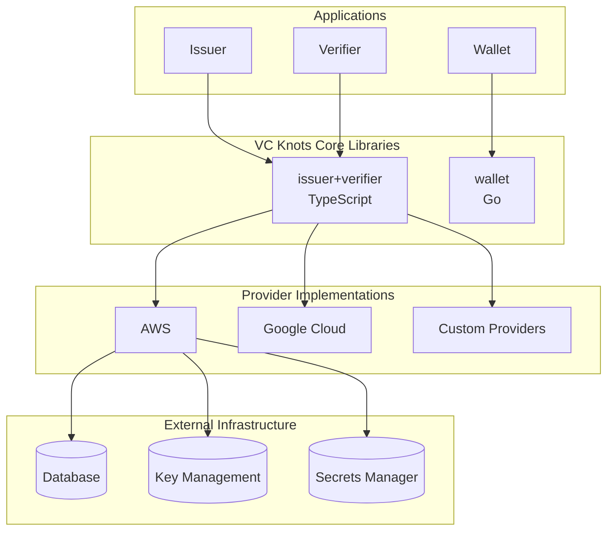
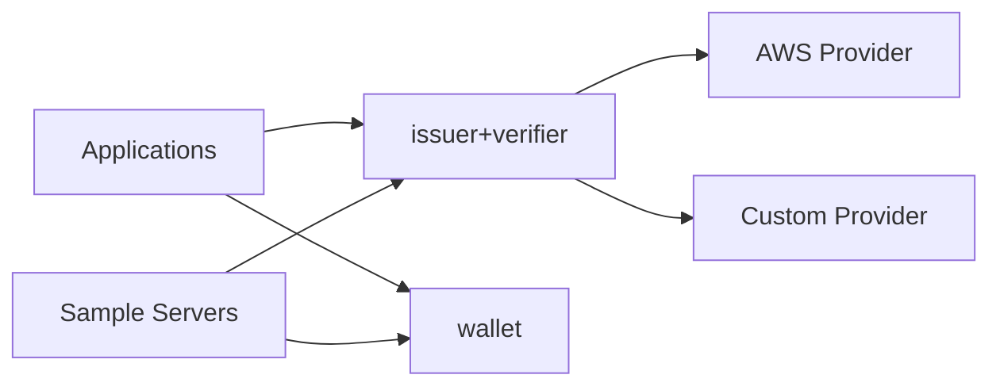
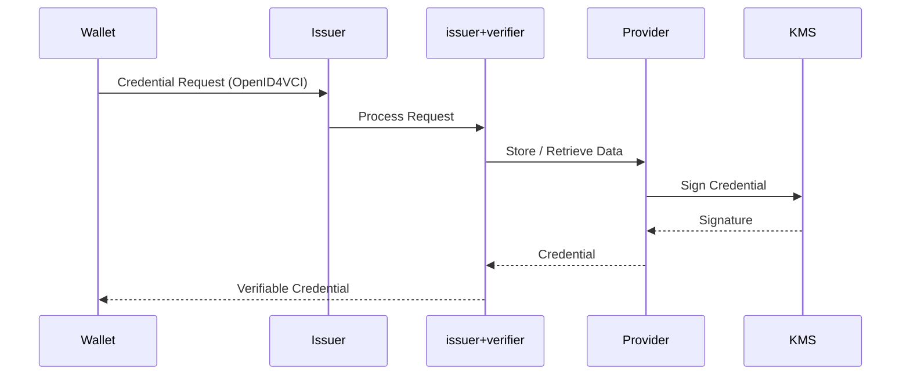
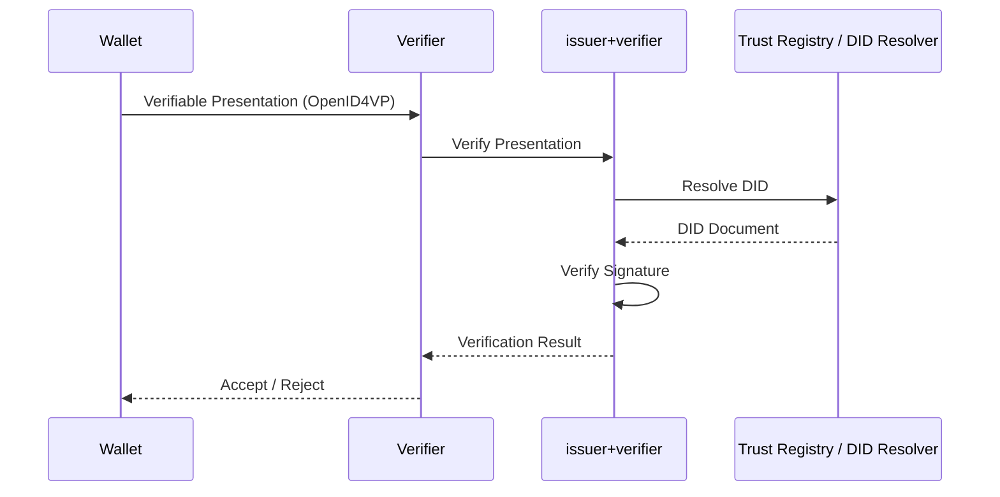
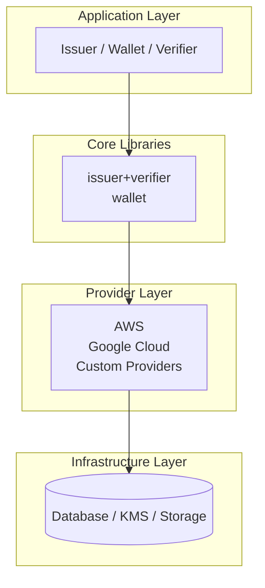
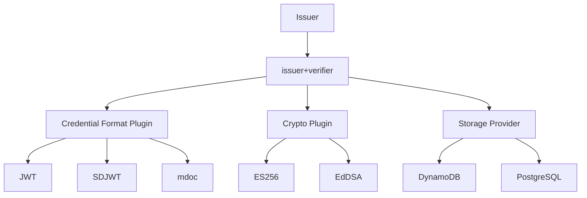

# Architecture Overview

VC Knots is a pluggable framework for building Verifiable Credentials ecosystems. The framework consists of reusable libraries, provider implementations, and sample server applications.

---

# Overall Architecture

The architecture is divided into four layers:

* **Applications** implement Issuer, Wallet, and Verifier services.
* **Core Libraries** implement OpenID4VCI/OpenID4VP and wallet functionality.
* **Providers** integrate cloud services and infrastructure.
* **Infrastructure** provides storage, key management, and secrets.

---

# Package Responsibilities

| Package               | Language   | Responsibility                                                              |
| --------------------- | ---------- | --------------------------------------------------------------------------- |
| `issuer+verifier`     | TypeScript | OpenID4VCI/OpenID4VP implementation, Issuer, Verifier, Authorization Server |
| `wallet`              | Go         | Wallet functionality, DID management, key management, credential operations |
| `aws`                 | TypeScript | AWS integrations (DynamoDB, KMS, Secrets Manager)                           |
| `server/single`       | TypeScript | Single-tenant reference server                                              |
| `server/aws`          | TypeScript | AWS Lambda deployment                                                       |
| `server/google-cloud` | TypeScript | Google Cloud deployment                                                     |

---

# Package Relationships

Sample servers are reference implementations that compose the reusable libraries.

---

# Credential Issuance Flow

### Steps

1. The Wallet requests a credential.
2. The Issuer delegates protocol processing to `issuer+verifier`.
3. Providers access storage and key management.
4. The credential is signed.
5. The Wallet receives the credential.

---

# Presentation Verification Flow

### Steps

1. The Wallet sends a Verifiable Presentation.
2. The Verifier delegates validation to `issuer+verifier`.
3. The framework resolves DIDs and verifies signatures.
4. The verification result is returned.

---

# Layered Architecture

---

# Design Principles

* **Protocol and infrastructure are separated.**
* **Cloud providers are replaceable through provider interfaces.**
* **Applications build on reusable libraries instead of implementing OpenID4VCI/OpenID4VP directly.**
* **Sample servers demonstrate deployment patterns without being part of the framework core.**

---

