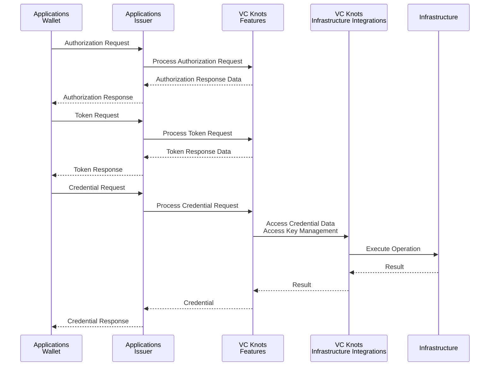
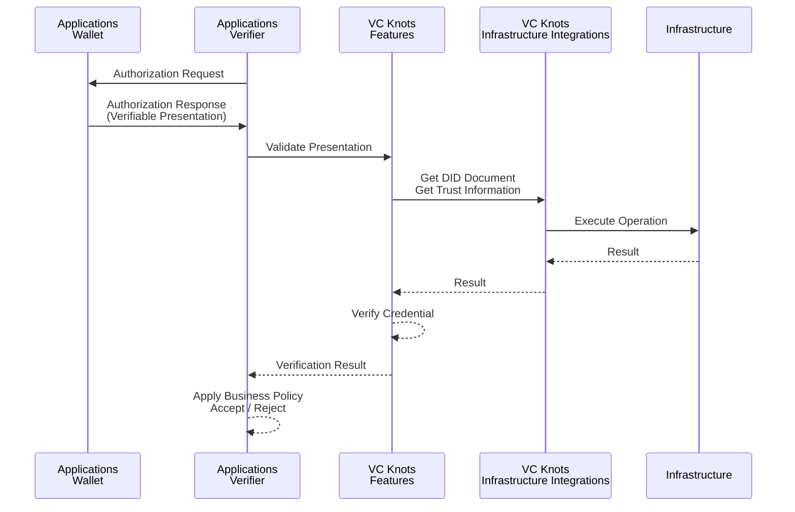

# アーキテクチャ概要

VC Knots は、Verifiable Credentials（VC）エコシステムを構築するためのプラガブルなフレームワークです。

VC エコシステムでは、OpenID4VCI / OpenID4VP などの標準プロトコルによる相互運用性が重要である一方、実際のシステム構成は用途や環境によって異なります。

例えば、利用するクラウド環境、ストレージ、鍵管理方式、Credential の発行ルールなどは、導入するシステムごとに異なる要件が存在します。

VC Knots では、このような差異を吸収するため、以下の拡張ポイントを提供しています。

- **Provider**
  - Features 内部のビジネスロジックに対する拡張ポイントを提供します。
  - 鍵生成、Nonce 生成、識別子管理、Credential 発行ポリシーなど、システム固有の処理を差し替え可能にします。
  - 詳細については[プラグイン開発 - Custom Provider の作成](./plugin-development/03-custom-provider.md)を参照してください。

- **Infrastructure Integrations**
  - データストア、KMS など外部インフラへの接続を抽象化します。
  - AWS や Google Cloud など異なる実行環境へ柔軟に対応できます。

この設計により、OpenID4VCI / OpenID4VP などの標準プロトコル処理と、インフラ依存やシステム固有のビジネスロジックを分離できます。

Features と Infrastructure Integrations を組み合わせることで Issuer、Wallet、Verifier を効率的に実装できます。
また、Samples により利用方法や推奨されるデプロイ構成を確認できます。

# 全体構成

VC Knots には次のレイヤーが存在します。

| レイヤー      | 役割     |
| --- | --- |
| **Applications**   | VC Knots を利用して構築される Issuer、Wallet、Verifier のアプリケーションです。    |
| **Features** | OpenID4VCI / OpenID4VP のプロトコルや Wallet 機能を提供します。 |
| **Infrastructure Integrations**      | データベースや KMS などの外部サービスとの接続を提供します。  |
| **Infrastructure** | データベース、ストレージ、鍵管理サービスなど、 Infrastructure Integrations が接続する外部インフラです。  |

# パッケージ構成

## Features

| パッケージ    | 言語   | 役割   |
| --- | --- | --- |
| `@trustknots/vcknots`  | TypeScript | OpenID4VCI / OpenID4VP、Issuer、Verifier、Authorization Server の実装 |
| `github.com/trustknots/vcknots/wallet`        | Go  | Wallet 機能、DID・鍵管理、Credential の管理   |

## Infrastructure Integrations

| パッケージ    | 言語   | 役割   |
| --- | --- | --- |
| `@trustknots/aws`    | TypeScript | DynamoDB、KMS、Secrets Manager など AWS サービスとの連携を提供   |
| `@trustknots/google-cloud`    | TypeScript | Cloud Firestore、Cloud KMS、Secret Manager など Google Cloud サービスとの連携を提供    |

## Samples

| パッケージ  | 言語    | 役割  |
| --- | --- | --- |
| `@trustknots/server-core`  | TypeScript | サンプルサーバーで共通利用するフレームワークおよび共通コンポーネントを提供   |
| `@trustknots/server` | TypeScript | シングルテナント構成のサンプルサーバー   |
| `@trustknots/multi-server`  | TypeScript | マルチテナント構成のサンプルサーバー   |
| `@trustknots/server-aws`    | TypeScript | サンプルサーバーを AWS（Lambda + CDK）へデプロイするための構成例  |
| `@trustknots/server-google-cloud` | TypeScript | サンプルサーバーを Google Cloud へデプロイするための構成例  |

# Verifiable Credentials ワークフローと VC Knots の役割

VC Knots は OpenID4VCI / OpenID4VP の標準プロトコル処理を Features として提供し、
Applications はこれらの機能を利用して Issuer、Wallet、Verifier を構築します。

以下では、代表的な VC 処理フローにおける各コンポーネントの役割を説明します。

## Credential 発行フロー（OpenID4VCI）

Credential 発行（OpenID4VCI）の処理は、次の流れで実行されます。

1. Wallet は OpenID4VCI の認可・トークン取得を経て、Issuer に Credential Request を送信します。
2. Issuer は VC Knots に Credential 発行処理を委譲します。
3. VC Knots は Infrastructure Integrations を利用して、Credential の発行に必要なデータの取得や鍵管理サービスへのアクセスを行います。
4. VC Knots は取得した情報を基に Verifiable Credential を生成・署名します。
5. 生成された Verifiable Credential が Wallet に返却されます。

## Presentation 検証フロー（OpenID4VP）

Presentation 検証（OpenID4VP）の処理は、次の流れで実行されます。

1. Verifier は Wallet に Authorization Request を送信し、Verifiable Presentation を要求します。
2. Wallet は Verifiable Presentation を含む Authorization Response を Verifier に返却します。
3. Verifier は VC Knots に Presentation の検証処理を委譲します。
4. VC Knots は Infrastructure Integrations を介して DID Resolver や Trust Registry などの外部サービスへアクセスします。
5. VC Knots は取得した情報を基に DID の解決、Presentation の署名検証、Credential の妥当性検証を実行します。
6. 検証結果が Verifier に返却され、Verifier は検証結果に基づいて Presentation を受け入れるかどうかを判断します。

