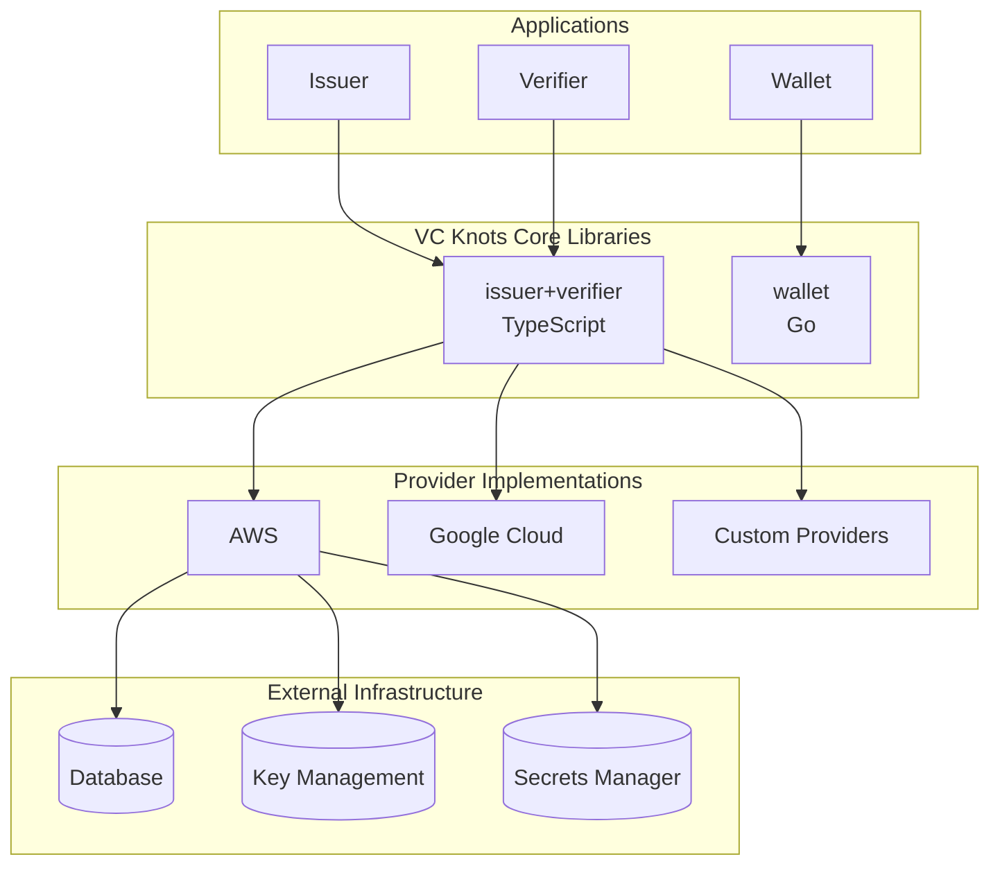
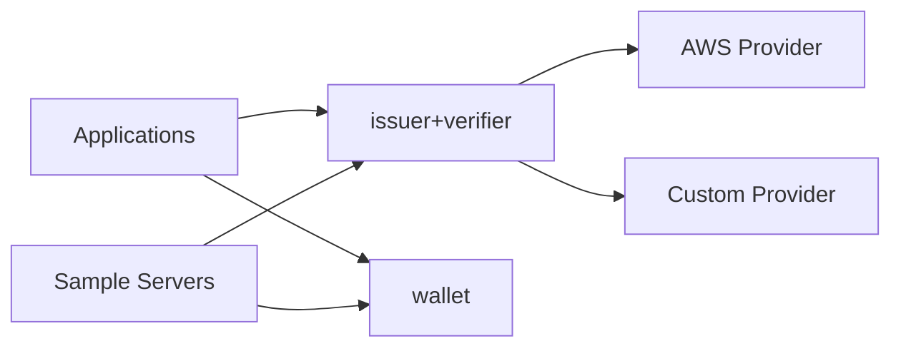
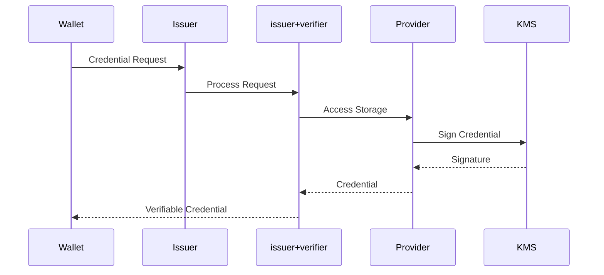
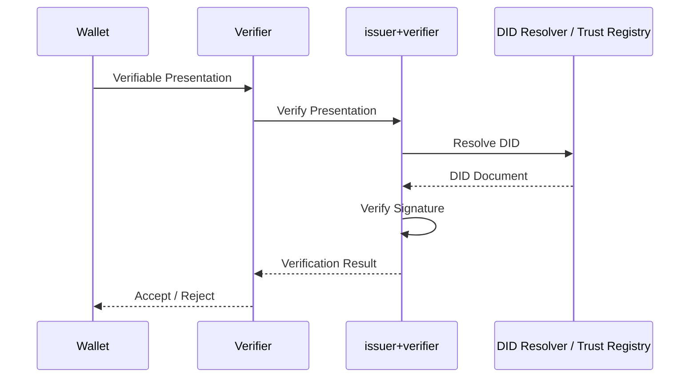
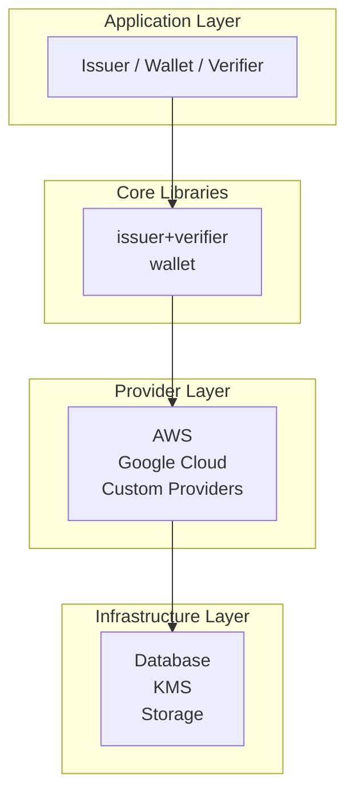

# アーキテクチャ概要

VC Knots は、**Verifiable Credentials（VC）エコシステム**を構築するためのプラガブルなフレームワークです。

OpenID4VCI / OpenID4VP を実装したコアライブラリを中心に、クラウドプロバイダーやデータストアなどのインフラをプラグインとして組み合わせることで、さまざまな構成の Issuer、Wallet、Verifier を構築できます。

---

# 全体構成

VC Knots は次の4つのレイヤーで構成されています。

| レイヤー               | 役割                                              |
| ------------------ | ----------------------------------------------- |
| **Applications**   | Issuer・Wallet・Verifier のアプリケーションを実装します。         |
| **Core Libraries** | OpenID4VCI / OpenID4VP のプロトコルや Wallet 機能を提供します。 |
| **Providers**      | データベースや KMS などの外部サービスとの接続を実装します。                |
| **Infrastructure** | データベースや鍵管理サービスなどの実際のインフラです。                     |

---

# パッケージ構成

| パッケージ                 | 言語         | 役割                                                              |
| --------------------- | ---------- | --------------------------------------------------------------- |
| `issuer+verifier`     | TypeScript | OpenID4VCI / OpenID4VP、Issuer、Verifier、Authorization Server の実装 |
| `wallet`              | Go         | Wallet 機能、DID・鍵管理、Credential の管理                                |
| `aws`                 | TypeScript | DynamoDB、KMS、Secrets Manager など AWS 向け Provider                 |
| `server/single`       | TypeScript | シングルテナント構成のサンプルサーバー                                             |
| `server/aws`          | TypeScript | AWS Lambda + CDK によるデプロイ例                                       |
| `server/google-cloud` | TypeScript | Google Cloud 向けデプロイ例                                            |

---

# パッケージ間の関係

各パッケージの関係は次のとおりです。

* アプリケーションは `issuer+verifier` および `wallet` を利用して実装します。
* `issuer+verifier` は Provider を介してデータベースや KMS などの外部サービスへアクセスします。
* `server/*` はライブラリを組み合わせたリファレンス実装です。

---

# Credential 発行フロー（OpenID4VCI）

### 処理の流れ

1. Wallet が Credential 発行要求（OpenID4VCI）を送信します。
2. Issuer は `issuer+verifier` にプロトコル処理を委譲します。
3. Provider がデータベースや KMS にアクセスします。
4. Credential が署名されます。
5. Wallet が Verifiable Credential を受け取り保存します。

---

# Presentation 検証フロー（OpenID4VP）

### 処理の流れ

1. Wallet が Verifiable Presentation を送信します。
2. Verifier は `issuer+verifier` に検証処理を委譲します。
3. ライブラリは DID 解決、署名検証、信頼性検証を実施します。
4. 検証結果を Verifier に返却します。

---

# レイヤードアーキテクチャ

アプリケーションはコアライブラリを利用して実装され、コアライブラリは Provider を介してインフラへアクセスします。この構造により、プロトコル実装とインフラ実装を分離し、クラウド環境やストレージを柔軟に差し替えることができます。

---

# 設計方針

VC Knots は以下の設計思想に基づいています。

* **プロトコル実装とインフラ実装を分離**し、ビジネスロジックをクラウド環境から独立させます。
* **Provider をプラグインとして実装**することで、AWS や Google Cloud など異なる環境へ容易に対応できます。
* **アプリケーションはライブラリを組み合わせるだけ**で、OpenID4VCI / OpenID4VP を実装できます。
* **サンプルサーバーはリファレンス実装**であり、ライブラリの利用方法やデプロイ構成の例を提供します。
